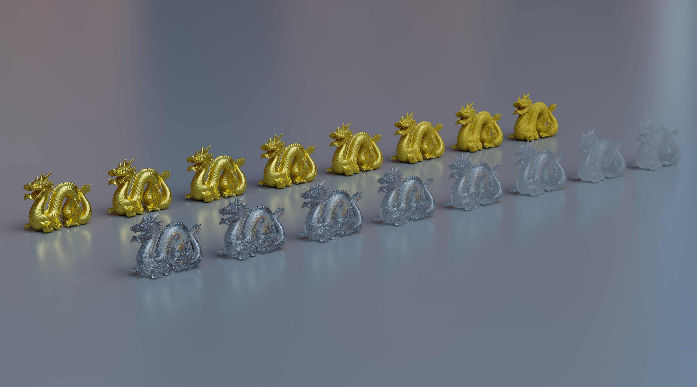
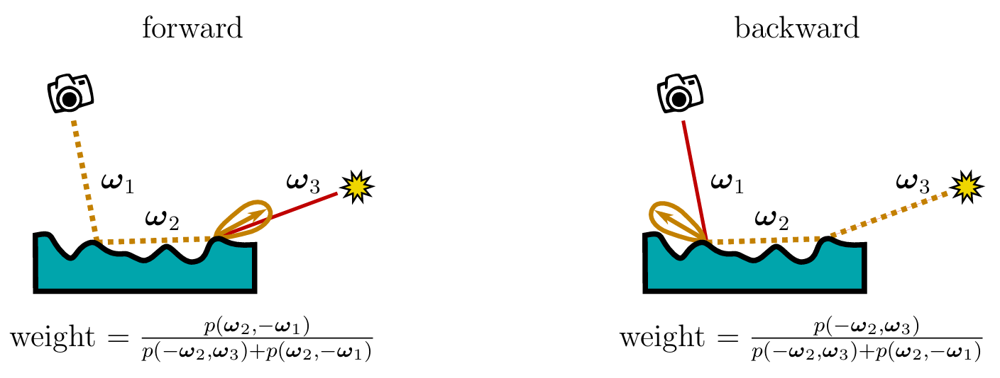
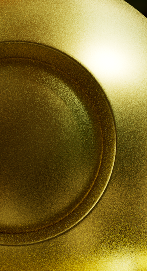

# DeepFacetX


Implementation of "Microfacet theory for non-uniform heightfields" in Autodesk Maya Arnold plugin. This is a plugin that allow user use customizable non-linearly blended conductor and dielectric BSDF node. When viewing at a grazing angle, non-uniform heightfields are more likely to differ from linearly-blended ones.

Reference Paper Link: [Microfacet theory for non-uniform heightfields (nvidia.com)](https://research.nvidia.com/labs/rtr/microfacet-theory-non-uniform-heightfields/)

Before using it inside Arnold, make sure your diffuse ray depth in Arnold render setting is greater than 1, to get transmission material working.

## Build

#### Setting environment variables

- `ARNOLD_PATH` to `C:\Program Files\Autodesk\Arnold\maya2023`

- `ARNOLD_PLUGIN_PATH` to `your plugin folder`, in this case is `/plugin` of this project
- `MTOA_TEMPLATES_PATH` the same as `ARNOLD_PLUGIN_PATH`
- Add `%ARNOLD_PATH%\bin` to your system's `PATH` variable

#### Build Commands

`mkdir build & cd build & cmake ..`

Then use your own tool to compile the project.

After generated the `.dll` file, make sure to copy the file under `/plugin`

## Principles

### Simulate Microsurface with Volumes

- Used volumetric light transport of modified microflake model to do random walk on the microsurface.
- Used optical depth to simplify the microfacet medium to several medium with uniform density.
- Used the exact method to sample visible normal on microsurface (for sampling phase function). (A Simpler and Exact Sampling Routine for the GGX Distribution of Visible Normals)

The pseudo-code for random walk BSDF evaluation is as follow:

```
// wi and wo are incident and outgoing direction
// zs is the optical depth of the boundary of the two layers
// max_scattering_order is the maximum order of random walk
// sigma_a() and sigma_b() are functions that can compute the extinction coeff of a constant medium
// lambda_a() and lambda_b() are smith lambda functions for layer a and b
// rng() is a function that uniformly generate random numbers in [0,1]
// See supplemental material for "MicrofacetTheoryforNon-UniformHeightfields" for more info

function EvalAsymetricMicrofacet(wi, wo, zs, max_scattering_order):
	z = 0
	w = -wi
	output = 0
	i = 0
	while i < max_scattering_order:
		sigma_in = z > zs ? sigma_a(w) : sigma_b(w)
		sigma_out = z > zs ? sigma_b(w) : sigma_a(w)
		delta_z = w.z * (-log(rng()) / sigma_in)
		if (z < zs) != (z + delta_z < zs):
			delta_z = (zs - z) + (delta_z - zs + z) * sigma_in / sigma_out
		z = z + delta_z
		if z > 0:
			break
		p = z > zs ? evalPhaseFunctionA(w, wo) : evalPhaseFunctionB(w, wo)
		tau_exit = max(z, zs) * lambda_a(wo) + min(z - zs, 0) * lambda_b(wo)
		output += exp(tau_exit) * p
		w = z > zs ? samplePhaseFunctionA(w) : samplePhaseFunctionB(w)
	return output
```


### Variance Reduction Techniques

- For multiple importance sampling in Arnold, we need to provide pdf, eval and sample
- We can’t know the exact pdf of the random walk, but can get an approximated pdf from single scatter plus diffuse (this is enough for unbiased path tracing)
- Use analytical solution for single scattering (no randomness for first bounce)
- Use bidirectional random walk for BSDF evaluation. Randomly starts from wi or wo. Accumulate NEE in random walks both from the wi and the wo.
- Combine the result of single and multiple scattering using multiple importance sampling (can use an approximated pdf)

| Weights for forward and backward walks in bidirectional eval |
| :----------------------------------------------------------: |
|                                    |


|  Unidirectional eval  |  Bidirectional eval  |
| :-------------------: | :------------------: |
|  |  |

As we can see from the result, bidirectional eval can greatly reduce fireflies due to randomness.

## References

[1] [Microfacet theory for non-uniform heightfields (nvidia.com)](https://research.nvidia.com/labs/rtr/microfacet-theory-non-uniform-heightfields/)

[2] [Multiple-Scattering Microfacet BSDFs with the Smith Model](https://eheitzresearch.wordpress.com/240-2/)

[3] [Physically Based Rendering: From Theory to Implementation (pbr-book.org)](https://pbr-book.org/4ed/contents)

[4] [A Simpler and Exact Sampling Routine for the GGX Distribution of Visible Normals](https://hal.science/hal-01509746/document)

[5] [Additional Progress Towards the Unification of Microfacet and Microflake Theories](https://onrendering.com/data/papers/ms16/ms16.pdf)

[6] [Microfacet Models for Refraction through Rough Surfaces](https://www.graphics.cornell.edu/~bjw/microfacetbsdf.pdf)

## Specially Thanks

[Eugene d'Eon:](https://eugenedeon.com/) One of the authors of the paper. We thank him for his help in clarifying some errors in the original paper.

[Chang Liu:](https://www.linkedin.com/in/chang-liu-0451a6208/) Alumni of Penn. We thank him for his help in interfacing with Arnold API.

